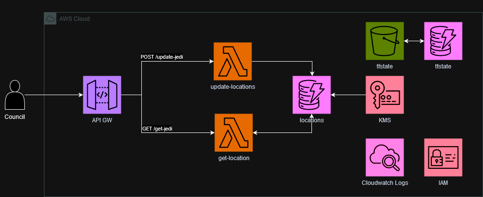

# tf-kantox-challenge-jedicouncil

## Architecture



The solution follows a serverless architecture pattern leveraging various AWS services:

- **API Gateway**: Serves as the entry point for client (The Council) requests and manages API traffic. It exposes two endpoints: one for updating jedi's information and another for retrieving jedi's information.
  
- **Lambda Functions**: Responsible for processing API requests and interacting with DynamoDB. Two Lambda functions are deployed:
  - `update-location`: Handles update requests from the API Gateway. It validates incoming data and updates records in the DynamoDB table.
  - `get-location`: Processes get requests from the API Gateway. It retrieves data from DynamoDB based on the Jedi's ID.

- **DynamoDB**: A NoSQL database service used to store and manage data. It stores records in a structured format, allowing for efficient retrieval and querying.

- **KMS**: A Customer Managed Key is used to encrypt the DynamoDB table in order to securely preserve Jedi's information.

- **Cloudwatch**: Cloudwatch is used to log the Council update requests.

- **IAM**: IAM Roles and Policies are used to manage the permissions between services.


## Prerequisites

- **Terraform**: Version 1.5.5 or higher. (It may work with previous versions if needed)
- **AWS Credentials**: You need valid AWS credentials to authenticate with AWS programmatically.

## Setup

Follow these steps to set up the solution:

1. **Clone the Repository**: Clone the repository to your local machine:

    ```bash
    git clone https://github.com/dgtvlz/tf-kantox-challenge-jedicouncil
    ```

2. **Adjust Configuration**: Adjust the `terraform/dev.auto.tfvars` file as needed.

3. **Prepare Terraform Backend**: Comment out or delete the current `terraform/backend.tf` file.

4. **Initialize Terraform**: Initialize Terraform in the `terraform` directory:

    ```bash
    cd terraform
    terraform init
    ```

5. **Apply Terraform Configuration**: Apply the Terraform configuration to deploy the solution:

    ```bash
    terraform apply
    ```

6. **Migrate Terraform State**: Migrate from a local Terraform state to a remote backend, reinitialize Terraform after deploying the solution:

    ```bash
    terraform init
    ```

    Follow the prompts to migrate the existing local state to the remote backend.

Once these steps are completed, the solution will be deployed in your AWS account, including a bucket and a DynamoDB table to manage the Terraform state remotely.
After applying, you will notice that two Outputs are being provided: `get_api_url` and `update_api_url`. These URLs will be used to interact with the solution.

## Usage

To interact with the solution, follow the instructions below:

### GET-LOCATION API

To retrieve Jedi information using the GET API, use the following `curl` command:

```bash
curl -X GET "<get_api_url>?jedi_id=12345"

Response:
{"jedi_id": "12345", "power_level": 90, "name": "Mace Windu", "planet": "Haruun Kal", "update_ts": 1707407787}
```

Replace `get_api_url` with the actual URL provided as the get_api_url output after applying the Terraform configuration. Additionally, replace 12345 with the ID of the Jedi you want to retrieve information for.

### UPDATE-LOCATIONS API

To update Jedi information using the UPDATE API and a JSON file, you can use the following `curl` command:

```bash
curl -X POST -H "Content-Type: application/json" -d @payload/jedis.json "<update_api_url>"

Response:
{"message": "Manifest received and processed successfully"}
```

Replace `update_api_url` with the actual URL provided as the update_api_url output after applying the Terraform configuration. Make sure to specify the correct path to the JSON file containing the Jedi information (in this example, payload/jedis.json).

## Terraform

The solution leverages several Terraform modules to provision and manage resources on AWS:

1. **KMS (Key Management Service)**:
   - Module: [cloudposse/kms-key/aws](https://registry.terraform.io/modules/cloudposse/kms-key/aws)
   - Description: This module provisions a customer-managed KMS key on AWS, which is used to encrypt sensitive data.

2. **Lambda Functions**:
   - Module: [terraform-aws-modules/lambda/aws](https://registry.terraform.io/modules/terraform-aws-modules/lambda/aws)
   - Description: This module simplifies the creation of AWS Lambda functions, which are used to execute code in response to API Gateway events.

3. **Terraform State Backend**:
   - Module: [cloudposse/tfstate-backend/aws](https://registry.terraform.io/modules/cloudposse/tfstate-backend/aws)
   - Description: This module sets up a remote backend for storing Terraform state files on AWS, enabling collaboration and state management.

## Future Improvements

Here are some potential enhancements that could be implemented in future iterations of the solution:

1. **Use VPC with VPC Endpoints to Deploy Lambdas Privately**:
   - Implement a Virtual Private Cloud (VPC) for enhanced security and isolation of resources.
   - Deploy Lambda functions within the VPC and utilize VPC endpoints to access AWS services privately, reducing exposure to the public internet.

2. **Use IAM Signature on API Methods for Request Authorization**:
   - Implement IAM Signature on both API methods (update and get) to enforce authorization on incoming requests.
   - This approach enhances security by validating the authenticity of requests using IAM credentials.

3. **Set a Custom DNS with a Proper Certificate on API Gateway**:
   - Configure a custom domain name for the API Gateway to provide a branded and more user-friendly endpoint.
   - Obtain and attach a proper SSL/TLS certificate to the custom domain to ensure secure communication between clients and the API.

4. **Switch to OpenTofu**:
   - Terraform is no longer open source, and OpenTofu is a Terraform fork maintained by the community to remain open source.
   - We used the latest Terraform open source version available, but with time, it may become obsolete.

## Infracost Report
[Infracost](https://www.infracost.io/docs/) is a nice tool which let you know the cost impact of cloud infrastructure.


```
 Name                                                                                      Monthly Qty  Unit                        Monthly Cost 
                                                                                                                                                 
 aws_api_gateway_rest_api.jedi_api                                                                                                               
 └─ Requests (first 333M)                                                          Monthly cost depends on usage: $3.50 per 1M requests          
                                                                                                                                                 
 aws_dynamodb_table.locations                                                                                                                    
 ├─ Write request unit (WRU)                                                       Monthly cost depends on usage: $0.00000125 per WRUs           
 ├─ Read request unit (RRU)                                                        Monthly cost depends on usage: $0.00000025 per RRUs           
 ├─ Data storage                                                                   Monthly cost depends on usage: $0.25 per GB                   
 ├─ Point-In-Time Recovery (PITR) backup storage                                   Monthly cost depends on usage: $0.20 per GB                   
 ├─ On-demand backup storage                                                       Monthly cost depends on usage: $0.10 per GB                   
 ├─ Table data restored                                                            Monthly cost depends on usage: $0.15 per GB                   
 └─ Streams read request unit (sRRU)                                               Monthly cost depends on usage: $0.0000002 per sRRUs           
                                                                                                                                                 
 module.kms_key.aws_kms_key.default[0]                                                                                                           
 ├─ Customer master key                                                                              1  months                             $1.00 
 ├─ Requests                                                                       Monthly cost depends on usage: $0.03 per 10k requests         
 ├─ ECC GenerateDataKeyPair requests                                               Monthly cost depends on usage: $0.10 per 10k requests         
 └─ RSA GenerateDataKeyPair requests                                               Monthly cost depends on usage: $0.10 per 10k requests         
                                                                                                                                                 
 module.lambda_get_location.aws_cloudwatch_log_group.lambda[0]                                                                                   
 ├─ Data ingested                                                                  Monthly cost depends on usage: $0.50 per GB                   
 ├─ Archival Storage                                                               Monthly cost depends on usage: $0.03 per GB                   
 └─ Insights queries data scanned                                                  Monthly cost depends on usage: $0.005 per GB                  
                                                                                                                                                 
 module.lambda_get_location.aws_lambda_function.this[0]                                                                                          
 ├─ Requests                                                                       Monthly cost depends on usage: $0.20 per 1M requests          
 ├─ Ephemeral storage                                                              Monthly cost depends on usage: $0.0000000309 per GB-seconds   
 └─ Duration (first 6B)                                                            Monthly cost depends on usage: $0.0000166667 per GB-seconds   
                                                                                                                                                 
 module.lambda_update_locations.aws_cloudwatch_log_group.lambda[0]                                                                               
 ├─ Data ingested                                                                  Monthly cost depends on usage: $0.50 per GB                   
 ├─ Archival Storage                                                               Monthly cost depends on usage: $0.03 per GB                   
 └─ Insights queries data scanned                                                  Monthly cost depends on usage: $0.005 per GB                  
                                                                                                                                                 
 module.lambda_update_locations.aws_lambda_function.this[0]                                                                                      
 ├─ Requests                                                                       Monthly cost depends on usage: $0.20 per 1M requests          
 ├─ Ephemeral storage                                                              Monthly cost depends on usage: $0.0000000309 per GB-seconds   
 └─ Duration (first 6B)                                                            Monthly cost depends on usage: $0.0000166667 per GB-seconds   
                                                                                                                                                 
 module.terraform_state_backend.aws_dynamodb_table.with_server_side_encryption[0]                                                                
 ├─ Write request unit (WRU)                                                       Monthly cost depends on usage: $0.00000125 per WRUs           
 ├─ Read request unit (RRU)                                                        Monthly cost depends on usage: $0.00000025 per RRUs           
 ├─ Data storage                                                                   Monthly cost depends on usage: $0.25 per GB                   
 ├─ Point-In-Time Recovery (PITR) backup storage                                   Monthly cost depends on usage: $0.20 per GB                   
 ├─ On-demand backup storage                                                       Monthly cost depends on usage: $0.10 per GB                   
 ├─ Table data restored                                                            Monthly cost depends on usage: $0.15 per GB                   
 └─ Streams read request unit (sRRU)                                               Monthly cost depends on usage: $0.0000002 per sRRUs           
                                                                                                                                                 
 module.terraform_state_backend.aws_s3_bucket.default[0]                                                                                         
 └─ Standard                                                                                                                                     
    ├─ Storage                                                                     Monthly cost depends on usage: $0.023 per GB                  
    ├─ PUT, COPY, POST, LIST requests                                              Monthly cost depends on usage: $0.005 per 1k requests         
    ├─ GET, SELECT, and all other requests                                         Monthly cost depends on usage: $0.0004 per 1k requests        
    ├─ Select data scanned                                                         Monthly cost depends on usage: $0.002 per GB                  
    └─ Select data returned                                                        Monthly cost depends on usage: $0.0007 per GB                 
                                                                                                                                                 
 OVERALL TOTAL                                                                                                                             $1.00 
──────────────────────────────────
34 cloud resources were detected:
∙ 9 were estimated, 8 of which include usage-based costs, see https://infracost.io/usage-file
∙ 25 were free, rerun with --show-skipped to see details

┏━━━━━━━━━━━━━━━━━━━━━━━━━━━━━━━━━━━━━━━━━━━━━━━━━━━━┳━━━━━━━━━━━━━━┓
┃ Project                                            ┃ Monthly cost ┃
┣━━━━━━━━━━━━━━━━━━━━━━━━━━━━━━━━━━━━━━━━━━━━━━━━━━━━╋━━━━━━━━━━━━━━┫
┃ project_sm6c6vet                                   ┃ $1           ┃
┗━━━━━━━━━━━━━━━━━━━━━━━━━━━━━━━━━━━━━━━━━━━━━━━━━━━━┻━━━━━━━━━━━━━━┛
```

## Tfsec Report

[Tfsec](https://github.com/aquasecurity/tfsec) is a nice tool which uses static analysis of your terraform code to spot potential misconfigurations.
No major issues were found.

```
Result #1 LOW Authorization is not enabled for this method. 
────────────────────────────────────────────────────────────────────────────────────────────────────────────────────────────────────────────────────────────────────
  apigateway.tf:22
────────────────────────────────────────────────────────────────────────────────────────────────────────────────────────────────────────────────────────────────────
   18    resource "aws_api_gateway_method" "get_jedi_method" {
   19      rest_api_id   = aws_api_gateway_rest_api.jedi_api.id
   20      resource_id   = aws_api_gateway_resource.get_jedi_resource.id
   21      http_method   = "GET"
   22  [   authorization = "NONE" ("NONE")
   23    }
────────────────────────────────────────────────────────────────────────────────────────────────────────────────────────────────────────────────────────────────────
          ID aws-api-gateway-no-public-access
      Impact API gateway methods can be accessed without authorization.
  Resolution Use and authorization method or require API Key

  More Information
  - https://aquasecurity.github.io/tfsec/v1.28.5/checks/aws/api-gateway/no-public-access/
  - https://registry.terraform.io/providers/hashicorp/aws/latest/docs/resources/api_gateway_method#authorization
────────────────────────────────────────────────────────────────────────────────────────────────────────────────────────────────────────────────────────────────────


Result #2 LOW Authorization is not enabled for this method. 
────────────────────────────────────────────────────────────────────────────────────────────────────────────────────────────────────────────────────────────────────
  apigateway.tf:47
────────────────────────────────────────────────────────────────────────────────────────────────────────────────────────────────────────────────────────────────────
   43    resource "aws_api_gateway_method" "update_jedi_method" {
   44      rest_api_id   = aws_api_gateway_rest_api.jedi_api.id
   45      resource_id   = aws_api_gateway_resource.update_jedi_resource.id
   46      http_method   = "POST"
   47  [   authorization = "NONE" ("NONE")
   48    }
────────────────────────────────────────────────────────────────────────────────────────────────────────────────────────────────────────────────────────────────────
          ID aws-api-gateway-no-public-access
      Impact API gateway methods can be accessed without authorization.
  Resolution Use and authorization method or require API Key

  More Information
  - https://aquasecurity.github.io/tfsec/v1.28.5/checks/aws/api-gateway/no-public-access/
  - https://registry.terraform.io/providers/hashicorp/aws/latest/docs/resources/api_gateway_method#authorization
────────────────────────────────────────────────────────────────────────────────────────────────────────────────────────────────────────────────────────────────────


Result #3 LOW Function does not have tracing enabled. 
────────────────────────────────────────────────────────────────────────────────────────────────────────────────────────────────────────────────────────────────────
  terraform-aws-modules/lambda/aws/src/.terraform/modules/lambda_get_location/main.tf:24-162
   via lambda.tf:52-68 (module.lambda_get_location)
────────────────────────────────────────────────────────────────────────────────────────────────────────────────────────────────────────────────────────────────────
   24  ┌ resource "aws_lambda_function" "this" {
   25  │   count = local.create && var.create_function && !var.create_layer ? 1 : 0
   26  │ 
   27  │   function_name                      = var.function_name
   28  │   description                        = var.description
   29  │   role                               = var.create_role ? aws_iam_role.lambda[0].arn : var.lambda_role
   30  │   handler                            = var.package_type != "Zip" ? null : var.handler
   31  │   memory_size                        = var.memory_size
   32  └   reserved_concurrent_executions     = var.reserved_concurrent_executions
   ..  
────────────────────────────────────────────────────────────────────────────────────────────────────────────────────────────────────────────────────────────────────
          ID aws-lambda-enable-tracing
      Impact Without full tracing enabled it is difficult to trace the flow of logs
  Resolution Enable tracing

  More Information
  - https://aquasecurity.github.io/tfsec/v1.28.5/checks/aws/lambda/enable-tracing/
  - https://registry.terraform.io/providers/hashicorp/aws/latest/docs/resources/lambda_function#mode
────────────────────────────────────────────────────────────────────────────────────────────────────────────────────────────────────────────────────────────────────


Result #4 LOW Function does not have tracing enabled. 
────────────────────────────────────────────────────────────────────────────────────────────────────────────────────────────────────────────────────────────────────
  terraform-aws-modules/lambda/aws/src/.terraform/modules/lambda_update_locations/main.tf:24-162
   via lambda.tf:1-17 (module.lambda_update_locations)
────────────────────────────────────────────────────────────────────────────────────────────────────────────────────────────────────────────────────────────────────
   24  ┌ resource "aws_lambda_function" "this" {
   25  │   count = local.create && var.create_function && !var.create_layer ? 1 : 0
   26  │ 
   27  │   function_name                      = var.function_name
   28  │   description                        = var.description
   29  │   role                               = var.create_role ? aws_iam_role.lambda[0].arn : var.lambda_role
   30  │   handler                            = var.package_type != "Zip" ? null : var.handler
   31  │   memory_size                        = var.memory_size
   32  └   reserved_concurrent_executions     = var.reserved_concurrent_executions
   ..  
────────────────────────────────────────────────────────────────────────────────────────────────────────────────────────────────────────────────────────────────────
          ID aws-lambda-enable-tracing
      Impact Without full tracing enabled it is difficult to trace the flow of logs
  Resolution Enable tracing

  More Information
  - https://aquasecurity.github.io/tfsec/v1.28.5/checks/aws/lambda/enable-tracing/
  - https://registry.terraform.io/providers/hashicorp/aws/latest/docs/resources/lambda_function#mode
────────────────────────────────────────────────────────────────────────────────────────────────────────────────────────────────────────────────────────────────────


  timings
  ──────────────────────────────────────────
  disk i/o             952.723µs
  parsing              311.463285ms
  adaptation           1.024148ms
  checks               5.170707ms
  total                318.610863ms

  counts
  ──────────────────────────────────────────
  modules downloaded   0
  modules processed    10
  blocks processed     766
  files read           57

  results
  ──────────────────────────────────────────
  passed               22
  ignored              10
  critical             0
  high                 0
  medium               0
  low                  4

  22 passed, 10 ignored, 4 potential problem(s) detected.
```